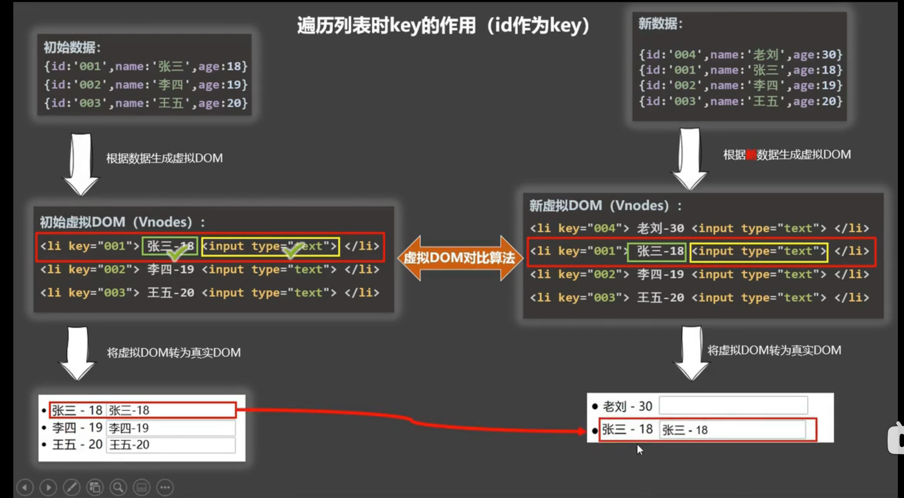

# react，Vue 中的 key 有什么作用?（key 的内部原理）

- 虚拟 Dom 中 key 的作用:
  - key 是虚拟 dom 对象的标识，当数据发生变化时，Vue 会根据 **新数据** 生成新的虚拟 DOM 随和 Vue 进行 **新虚拟 DOM** 与 **旧虚拟 DOM** 的差异比较。
- 对比规则：

  - 旧虚拟 DOM 中找到了 与新虚拟 DOM 相同的 key：

    - 若虚拟 DOM 中内容没变，直接使用之前的真实 DOM
    - 若虚拟 DOM 中的内容变了，则生成新的真实 DOM，随后替换掉页面中之前的真实 DOM

  - 旧虚拟 DOM 中未找到与新虚拟 DOM 相同的 key 创建新的真实 dom，随后渲染到页面

- 用 index 作为 key 可能会引发的问题：
  - 若对数据进行：逆序添加，逆序删除等破环顺序的操作；
    - 会产生没有必要的真实 DOM 更新 ===》 界面效果没问题，但效率低
  - 如果结果还包含输入类的 DOM：
    会产生错误 DOM 更新 ===》 界面有问题
- 开发中如何选择最好的 key
  - 最好使用每条数据的唯一标识作为 key,比如 id，手机号，身份证，学号等唯一值。
  - 如果不存在对数据的逆序添加，逆序删除等破环顺序的操作，仅用于列表用于展示使用 index 作为 key 是没有问题的。
    
